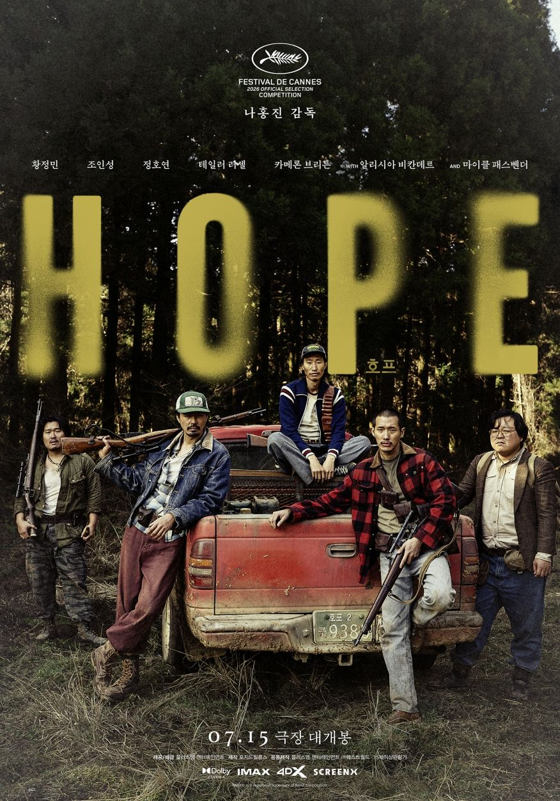
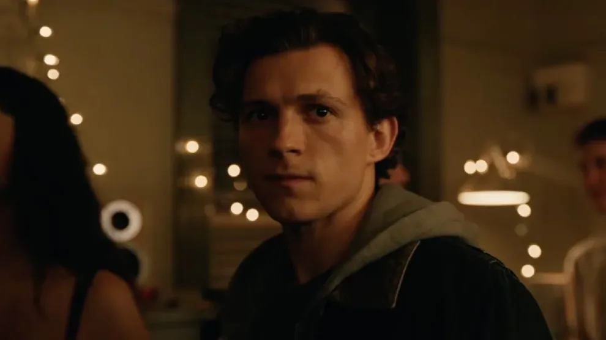

호프랑 스파이더맨:브랜드 뉴데이 두 편을 최근에 봤다.

일단 호프는 외계인의 침공 같은 느낌으로 보긴 했고, 스파이더맨은 별 기대 없이 봤는데 각각의 얘기를 좀 해보면 재밌을 것 같아서 그냥 지금 마이크를 켜고 얘기를 하고 있다.

> ⚠️ 충분히 스포일러를 담고 있으니 참고

### <호프>

전반부 약 50분 동안 황정민 배우가 나오는 파트에서는 외계인이 거의 등장하지 않는다. 이 부분을 좋게 보시는 분들도 있겠지만, 제 개인적으로는 초반이 약간 지루하게 느껴졌다.

하지만 그 이후 정원 장면부터 액션 씬이 휘몰아치고, 다시 산에서 한 번 더 몰아치는 연출은 정말 재미있었다. 확실히 긴장감 넘치는 장면들에서는 연출이나 카메라 워크가 아주 훌륭했다. 최근 넷플릭스 같은 OTT에서 보던 작품들은 예전만큼 대작 느낌이 덜해서 가볍게 소비하듯 보곤 했는데, 이 영화는 극장에서 볼 만한 가치가 있다는 생각이 들었다.

다만 개인적으로 아쉬운 부분들도 몇 가지 있었다.

가장 아쉬운 점은 설정이 다소 과도하고 불협화음이 느껴진다는 것이다. 외계인이 등장하는 설정을 감안하더라도 도대체 어느 시대인지 가늠하기 어렵다. 스마트폰이 없는 걸 보면 확실히 요즘 시대는 아닌 것 같고, DMZ 근처라는 배경까지는 이해하겠는데 인물들의 비주얼이 너무 따로논다. 

1. 황정민의 패션: 독일 장교처럼 입고 나오는 패션이 어딘가 어색하고 이상했다.
    
2. 조인성 패거리의 비주얼: 트럭커 패션 같은 스타일도 이상할뿐더러, 왜 그렇게 씻지 않은 것처럼 더럽게 묘사했는지 의문이 든다.
    
3. 어촌계 인물들의 패션: 반면 뒤이어 어촌계에서 나오는 세 분은 금팔찌를 차고 파란색 옷을 입는 등 굉장히 패셔너블하게 등장한다.

이 세 그룹의 비주얼 톤앤매너가 너무 맞지 않아서 몰입을 방해했다. 의도된 설정인지는 모르겠지만, 전체적으로 조화롭지 못하고 겉도는 느낌이 강해 아쉬웠다.

영화 후반부의 말 타는 액션 같은 장면들은 개인적으로 아주 좋았다. 다만 구성상 아쉬운 점들을 몇 가지 정리해 보자면 

1. 개그 장면의 늘어지는 템포: 일부러 웃기려고 연출한 장면들의 호흡이 너무 길다. 할아버지 다리 밑 장면이나, 말과 차를 오가며 왔다 갔다 하는 씬이 대표적이다. 개그/유머에 대한 부분을 3분의 2 정도로만 줄였어도 훨씬 좋았을 텐데, 전체적으로 분량이 길어져서 아쉽다. 감독의 의도가 있었겠지만 조금 과한 느낌이 든다.
    
2. 결말과 떡밥 회수: 관객들 사이에서 쿠키 영상과 마지막 부분을 바꿨어야 한다는 의견이 많고, 나 역시 그 생각에 공감한다. 제작진도 이 부분을 고민했을 텐데, 차기작을 염두에 둔 의도적인 선택이었는지는 지켜봐야 할 것 같다. 예전에도 이런 3부작짜리 SF 영화가 있었던 것 같은데, 뿌려둔 떡밥들이 앞으로 잘 회수될지가 아니면 한국 SF 영화의 고질적인 아쉬움으로 남지 않을까 우려된다.
    
3. 외국 배우 캐스팅의 의문: 외계인 역할에 굳이 외국 배우를, 그것도 마이클 패스벤더 같은 배우를 쓸 필요가 있었는지 의문이다. 솔직히 연기라고 할 만한 부분이 거의 없어서 AI로 대체해도 무방했을 수준이다. 마지막에 대사 자막이 나오는 장면 외에는 굳이 그 배우의 연기력이 필요한 대목이 있었나 싶다.

그럼에도 이번 영화 <호프>가 개봉하면서 긍정적인 영향도 분명히 있다. 워낙 대작이자 기대작이다 보니 트위터나 유튜브 등에서 많은 이들이 세계관을 분석하고 상상의 나래를 펼치는 '상상 글'들이 쏟아지고 있는데, 이런 현상을 지켜보는 재미가 쏠쏠하다.

관객들이 영화를 여러 번 곱씹어 보고, 다회차 관람을 하거나 GV(관객과의 대화)를 찾아보는 문화가 활성화되는 계기가 된 것은 확실해 보인다. 이런 활기가 영화 산업 전반에 좋은 자극이 되기를 바란다. 개인적으로는 <호프 2>와 <호프 3>도 계속해서 나와주었으면 좋겠다.

### <스파이더맨 브랜드 뉴 데이>

사실 스파이더맨 시리즈를 그리 좋아하지는 않았다. 예전 토비 맥과이어 버전을 굉장히 좋아하긴 했지만, 스파이더맨이라는 캐릭터 자체가 항상 너무 불행하게 나오는 게 보기 힘들었거든요. 돈도 없고, 여자친구도 맨날 뺏기고, 가족도 죽고, 왜 이렇게 맨날 불행해야만 하는지 그 불행을 보는 게 짜증이 나서 그동안 잘 안 보게 되었다.

이번 톰 홀랜드 버전도 원래 볼 생각이 없었다. 전편을 안 봐서 주인공이 왜 친구들의 기억에서 잊혀졌는지도 모르는 상태였는데, 동생 집에 갔다가 우연히 같이 극장에 가서 보게 되었다.

그런데 생각보다 정말 재밌게 봤다.

- 영웅의 고뇌나 피해를 입지 않으려고 애쓰는 모습 등 스토리는 뻔하지만, 연출이 훌륭해서 2시간 30분이라는 러닝타임이 전혀 아깝지 않고 만족스러웠다.
- 이전에 봤던 블랙 위도우 같은 아쉬웠던 마블 영화들에 비하면 훨씬 훌륭했고, 대중적으로 아주 잘 만든 영화라는 생각이 든다. 마블의 세계관이나 디테일한 설정은 잘 모르지만 전체적인 스토리가 나쁘지 않았다.

### 두 영화를 보고 느낀 점

<호프>는 나홍진 감독의 전작 '곡성'을 완벽히 이해하지 못한 상태였어서, 유튜브로 곡성 해석 영상을 찾아보며 나름대로 공부를 하고 갔다. 그런데 오히려 그게 독이 되었던 것 같다. 영화를 보는 내내 모든 장면과 인물이 의심스러웠다.

- '조인성이 죽지를 않는데, 혹시 외계인인가?'
- '아니면 황정민이 외계인인가?'
- '무슨 바이러스가 있는 건가?'

계속 이런 생각이 꼬리를 물고 감독의 숨은 의도를 찾으려고 애쓰다 보니 영화를 보는 것 자체가 너무 피로하고 힘들었다. 어떻게 보면 그 혼란 자체를 감독의 의도였을지도 모르겠다. 

하지만, 단순히 즐기기에는 아무 생각 없이 편하게 볼 수 있었던 스파이더맨이 개인적으로 훨씬 좋았다. 스파이더맨은 '결국 이렇게 흘러가서 적응하고 해결하겠지' 하는 뻔한 흐름을 알고 보니까 머리 쓸 필요 없이 푹 빠져서 즐길 수 있었다. 개인적으로 둘다 보기를 추천하지만, 아주 다른 취향을 가지고 있는 몇명이서 볼거라면 나는 스파이더맨을 더 추천할 것 같다. 