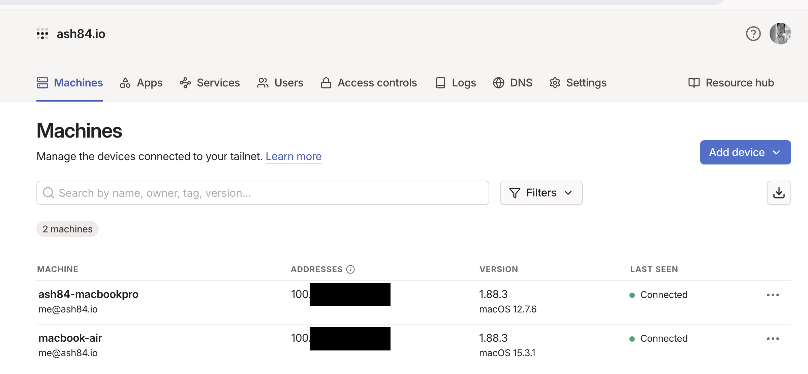

지금은 M1 맥북에어가 사실상 주력기기로 사용하고 있는데, 이전에는 인텔 맥북프로를 주로 사용했었다. 자세히 모델은 기억나지 않지만 터치바가 있는 모델이었는데 거의 안쓰게 되었다. 몇일전에 그래도 어떻게 활용해 볼까 생각을 해서 몇가지 생각난 건 아래와 같다. 

- 인텔 맥북프로 하드웨어 스펙 

```shell
(system_profiler SPHardwareDataType | grep -E "Model Identifier|Processor Name|Memory"; \
 echo "Storage:"; \
 system_profiler SPStorageDataType | awk -F': ' '/Capacity:/{ if (!seen[$2]++) print "  " $2 }')
 
Model Identifier: MacBookPro13,2
Processor Name: Dual-Core Intel Core i7
Memory: 16 GB

Storage:
  250.69 GB (250,685,575,168 bytes)
```


**1. 우분투를 깔아서 사용하기** 
- 고민을 했던 부분인데 개인적으로 과연 내가 우분투를 쓰게 될까? 이제까지 안썼는데? 라는 생각이 들어서 실효성이 낮다는 생각이 들었다. 완전히 맥북이 없는 상태에서 우분투를 쓴다면 모를까, 메인 기기가 되긴 어렵다고 판단했다. 

**2. 분해해서 지금 맥북에어에 적용하기** 
- 램은 메인보드에 납땜되어 있어서 분리가 어렵고, SSD는 외장 SSD로 NVMe 어댑터를 이용하면 가능할 것 같았다. 그렇지만 이건 차선책으로 생각했다. 좀 더 활용성이 높게 쓸 수 있는건 없을지 좀 더 고민 

**3. 모니터를 떼고 하판만 사용하기**
- 유투브에서 예전에 중국에서 하판만 판다는 애기가 있었고, 실제로 그걸 해본 [영상](https://www.youtube.com/watch?v=5h2EIfsN2Dw&t=348s)이 있어서 약간 혹했다. 
- 일단 뭔가 분해를 해야하고 그것을 위해서 드라이버를 구매하는 등의 추가 비용이 들어서 이건 스킵. 

**4. 팔아치우기** 
- 생각보다 돈이 안될것 같았다. 애초부터 이건 좀 어렵다고 생각을 했다. 이미 M시리즈가 나온지 꽤 되었다. 

**5. SSH 접속가능하게해서 홈개발서버로 사용하기** 
- 이런저런 고민을 chatgpt에 털어놓다가 나온 아이디어인데, 램과 하드웨어를 모두 사용할 수 있다는 점에서 마음에 들었다. 
- 기존에 쓰고 있던 AWS Lightsail을 처분한 상태였는데, 데이터 수집이나 그런것들을 하려면 개발서버가 하나 있었으면 했다. 


결국 선택한건 2번. **대신 인텔 맥북을 크롬쉘모드로 둔 상태로 전원만 연결해두고 맥북에어에서 SSH로 접속해서 사용할 수 있어야** 쓸 것 같았다. 매번 쓸때마다 인텔 맥북 열고, IP 확인해서 접속하는건 너무 귀찮았다. 결국 귀찮으면 내가 안쓰게 된다. 


## PEM 파일 만들고 등록하기 
- 이건 사실상 서버에서 접속하기 위한 일반적인 절차라서 짧게 코드만 공유하고 스킵

```shell 
# 인텔 맥북에서 수행 

# 키 발급 
openssl genpkey -algorithm RSA -out key.pem -pkeyopt rsa_keygen_bits:4096
chmod 400 key.pem
ssh-keygen -y -f key.pem > key.pub

# 키 등록 
mkdir -p ~/.ssh
chmod 700 ~/.ssh
touch ~/.ssh/authorized_keys

# 공개키(한 줄)를 붙여넣고 저장
chmod 600 ~/.ssh/authorized_keys
```

- 이후에 `key.pem` 파일을 접속을 하는 대상(여기서는 맥북에어)에 복사해두고 사용 


## tailscale

이걸 사용하는 이유는 결국 IP를 인텔맥북에 들어가서 확인해서 ssh로 접속하고 싶지 않기 때문이다. brew로 설치하는 방법도 있지만 공식 홈페이지에서 다운로드 받아서 사용하기를 권장한다. 

[https://tailscale.com](https://tailscale.com/)

brew로 설치한 경우 이상하게 UI가 깨지는 문제가 있어서 삭제하고 tailscale 홈페이지에서 다시 받아서 설치 했다. 설치하고 가입하고 로그인을 양쪽 2개의 컴퓨터에하면 아래와 같은 화면을 볼 수 있다. 



여기에서 저 IP를 쓰거나 혹은 다른 이름으로 접속할 수 있다. 

```shell 
# 맥북에어 - 접속 클라이언트
ssh -i key.pem ash84@100.x.x.x
ssh -i key.pem ash84@ash84-macbookpro
```

## 맥북 원격로그인 권한 켜기 

진행하다보면 막히는 부분이 `원격로그인` 권한에 대한 부분인데, 맥에서 공유(sharing)에서 원격로그인 권한을 켤 수 있다. 
이 작업을 해야 SSH로 접근할때 문제 없이 접근이 되고, 에러가 나면 `connection refused` 에러가 발생한다. 

```shell
sudo systemsetup -getremotelogin # 확인 명령어
sudo systemsetup -setremotelogin on
```

`systemsetup`으로 설정할 수도 있다고하는데, UI에서 하는것을 추천한다. 
UI에서 들어가는 방법은 맥에서 설정 > 공유(sharing)으로 들어가면 원격로그인을 찾을수 있다. 
그 부분을 허용하면 된다. 


## 맥북 슬립 방지 시키기 

제일 중요한건 크롬쉘모드, 즉 인텔맥북을 닫아두고 전원을 연결해둔 상태에서 인터넷이 연결이 되고 tailscale이 동작해야 내가 접속을 할 수 있다. 이게 안되면 사용하기 전에 다시 열고, 켜주고하는 작업을 해야하는데 엄청 귀찮게 된다.

아래의 명령어를 쓰면 슬립모드로 안들어간다고 한다. 
될지 안될지 몰라서 수행해봤는데 약 12시간 정도 지났는데 문제 없이 동작을 한다. 

```shell 
# 절대 슬립 방지 (sudo 권한 필요)
sudo pmset -a disablesleep 1
# 변경사항 확인
pmset -g
```

--- 

인텔맥북 활용도를 높이고 싶어서 진행한 부분인데, 생각보다 만족스럽긴하다. 아직 pyenv 설치하는 정도밖엔 셋업을 하지 않았다. 여러 인터넷에 있는 다양한 자료들을 찾아보면서, 느낀점은 생각보다 맥북이 오래 쓰지 못하는것 같다는 생각이 들었다. 그리고 체감상으로는 인텔맥북이 느렸지만 그렇다고 아예 못쓸 정도는 아니여서 집에 만약 나 말고 다른 개발을 안하지만 맥을 쓰는 사람이 있다면 그냥 쓰게 했을것 같다는 생각이 들었다. 